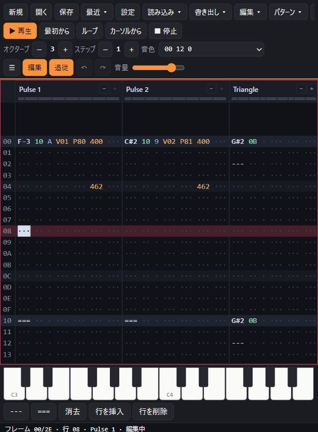

# FamiTracker-web 🎵

> WebAssembly port of the [Dn-FamiTracker](https://github.com/Dn-Programming-Core-Management/Dn-FamiTracker) sound engine and tracker editor, running natively in modern web browsers.

[](LICENSE.md)
[](https://webassembly.org/)
[](web/)

**NSF読み込みは、このWeb版で独自に追加した機能です。** NSF／NSFeの演奏結果を編集可能なトラッカーデータへ変換し、ブラウザで編集・再構築して `.dnm` として保存できます。

**NSF import is an extension added by FamiTracker-web.** Convert NSF/NSFe playback into editable tracker data, edit or reconstruct it in the browser, and save it as a `.dnm` module.

[English](#english) | [日本語 (Japanese)](#日本語-japanese)

### Screenshot / 画面キャプチャー

[](https://hhungry2.github.io/FamiTracker-web/editor.html)

Web editor with “Trapped Within a Memory” by AtomicMelodies loaded.
デモ曲「Trapped Within a Memory」（AtomicMelodies）を開いたウェブ版エディターです。

### Repository layout / ファイル構成

```text
FamiTracker-web/
├── web/                       # Browser application / ウェブ版
│   ├── html/                  # Player and editor UI (HTML, CSS, JavaScript)
│   ├── src/                   # WebAssembly bindings and browser integration
│   ├── compat/                # MFC / Win32 compatibility layer
│   ├── test/                  # Browser engine and editor tests
│   ├── tools/                 # Web build tools
│   ├── Makefile               # Emscripten build
│   └── dist/                  # Generated website (ignored by Git)
├── desktop/                   # Windows application / デスクトップ版
│   ├── Source/                # Original C++ application; engine reused by web/
│   ├── res/                   # Windows resources
│   ├── Dn-help/               # Desktop manual (Git submodule)
│   ├── cmake/                 # Desktop CMake configuration
│   ├── Dn-FamiTracker.sln      # Visual Studio entry point
│   ├── CMakeLists.txt         # CMake entry point
│   └── release.bat            # Desktop release packaging
├── demo/                      # Modules shared by both versions / 共通のデモ曲
├── docs/                      # Format specifications and development notes / 共通資料
└── LICENSE*                   # Licenses for both versions / 共通ライセンス
```

Start with [web/README.md](web/README.md) for the browser build or
[desktop/README.md](desktop/README.md) for the Windows build.
The web build compiles the engine from `desktop/Source/` with `web/compat/`;
the C++ source is maintained in one place.

ウェブ版は [web/README.md](web/README.md)、デスクトップ版は
[desktop/README.md](desktop/README.md) が入口です。ウェブ版は
`desktop/Source/` のエンジンを `web/compat/` と組み合わせてビルドします。
共通の C++ コードは複製せず、一か所で管理します。

---

<a name="english"></a>
## English

**FamiTracker-web** is an open-source fork of [Dn-FamiTracker](https://github.com/Dn-Programming-Core-Management/Dn-FamiTracker) that compiles the tracker's core playback engine and document model to WebAssembly via Emscripten. It brings sample-accurate playback, authoring, and `.dnm` / `.0cc` / `.ftm` module support directly into modern web browsers without native installations or plugins.

The audio engine follows the same interface conventions as [ZXTune Web](https://github.com/hhungry2/zxtune-web), designed for standalone browser playback and integration into online platforms like [zxtune.com](https://zxtune.com/).

**Try it:** the [editor](https://hhungry2.github.io/FamiTracker-web/editor.html) and the [player](https://hhungry2.github.io/FamiTracker-web/) on GitHub Pages, built from `main` on every push (`.github/workflows/pages.yml`), and on [zxtune.com](https://zxtune.com/create/famitracker).

---

### ✨ Key Features

#### 1. High-Accuracy WebAssembly Sound Engine
- **Authentic Chip Emulation**: Compiles the original `desktop/Source/` sound driver and emulation cores (2A03/NES APU, VRC6, VRC7, FDS, MMC5, Namco 163, Sunsoft 5B).
- **Format Support**: Plays native `.dnm`, `.0cc`, and `.ftm` modules through the exact same synthesis path as the desktop tracker's WAV export.
- **Full Playback Control**: Sample-accurate seeking, loop handling, channel mute/solo masks, and multi-track (subsong) switching.
- **AudioWorklet & Web Worker Architecture**: Glitch-free, low-latency audio rendering with the browser owning the audio clock. No `SharedArrayBuffer` or COOP/COEP headers required.
- **Tracker State Snapshots**: Real-time polling of current frame, row, tempo, speed, elapsed time, and active channels.

#### 2. Full-Featured In-Browser Tracker Editor (`editor.html`)
- **Document Management**: Create new songs, open `.dnm` / `.0cc` / `.ftm` files, and export clean `.dnm` files.
- **Crash-Resilient Autosave**: Modules in progress are automatically backed up to browser `localStorage` on every edit.
- **Desktop Keyboard Mapping**: Familiar tracker controls (Z/Q rows for notes, `1` for note cut, `\` for note release, hex values for instruments/volume/effects).
- **Pattern Grid**: Smooth Canvas-rendered pattern view tracking the playback row, with neighbouring frames dimmed.
- **Editing Tools**: Multi-cell selection, copy/cut/paste, row insertion/deletion, transposition, and multi-level Undo/Redo.
- **Live Preview**: Play from current frame, start of song, pattern loop, or cursor position (`Enter`, `F5`-`F8`), with live interactive piano keyboard.
- **Song & Frame Organizer**: Reorder, insert, duplicate, and configure frame patterns, speed, tempo, rows, and highlight intervals; reorder tracks.
- **Song Menu**: Clone and merge duplicated patterns, populate unique patterns, clear patterns, and estimate the song length.
- **Module Menu**: Detune settings (with their CSV files), grooves (with the desktop's tools), device mix offsets and hardware-based mixing, the VRC7's patches (external OPLL), and removing unused instruments, patterns and DPCM samples.
- **Instrument Editor**: The panels of the desktop's editor for every chip. Sequences (Volume, Arpeggio, Pitch, Hi-Pitch, Duty) as bar graphs and text, with "Select next empty slot" and "Clone sequence"; the 2A03's DPCM keys (sample, pitch, loop, delta counter), samples (`.dmc` and WAV files in, `.dmc` out) and sample editor; the FDS's wave, modulation table and sequences; the N163's waves (size, position, count, text); the VRC7's patches and registers. The keyboard and an on-screen piano play the instrument as it is edited. Instruments load from and save to `.fti` files.
- **Expansion Chips**: Toggle expansion audio chips on the fly, with channel-level mute and solo support.
- **Exports**: WAV (by song passes or time, chosen channels, one file per channel, sample rate), NSF / NSFe / NSF2 / NES / BIN / PRG / ASM through the desktop's own NSF compiler and drivers, and text, JSON and CSV rows, as the desktop's File menu makes them.
- **Imports**: Text exports, and the tracks, instruments, grooves and detune tables of another module.
- **Bilingual Interface**: Native support for English and Japanese.

#### 3. NSF / NSFe Import — Added by FamiTracker-web

**This project adds NSF import to the Dn-FamiTracker-based browser editor.** Using [NSFPlay](https://github.com/bbbradsmith/nsfplay) for playback, FamiTracker-web analyzes the chip states and converts the results into editable tracker modules.

- **Import, Edit and Save**: Open an `.nsf` or `.nsfe` file, select a subsong, and convert its notes, volume, effects, waves, patches and DPCM samples into module data. The initial import uses one row per playback frame (speed 1) and can be edited and saved as `.dnm`.
- **Reconstruct the Import**: Song > Reconstruct NSF import combines unchanged intervals in a separate track while retaining event timing and the original track. This is also an extension added by this web project.

The data is inferred from playback. Driver-specific decoding of the original music structure is a future project in [issue #14](https://github.com/hhungry2/FamiTracker-web/issues/14). See the [import-method comparison and reconstruction results](docs/NSF_import_method_comparison.md) for the current scope.

---

### 📊 Implementation Status

| Feature / Component | Status | Details |
| :--- | :--- | :--- |
| **WASM Core Engine** | ✅ Operational | Sound generator, loaders, and chip emulators compiled to WASM |
| **2A03 / VRC6 / N163** | ✅ Verified | Tested and verified with demo modules |
| **VRC7 / FDS / MMC5 / 5B** | ⚠️ Implemented | Emulation code included; real-world verification in progress |
| **Seeking / Loops / Mutes** | ✅ Operational | A seek skips most of the way (0.3 to 1.1 s to reach 90 % of a demo module); the audio after it matches continuous playback sample for sample |
| **Multi-Track Modules** | ✅ Operational | Subsong selection implemented |
| **Web Player Demo** | ✅ Operational | Worker + AudioWorklet pipeline (`web/html/index.html`) |
| **Web Tracker Editor** | ✅ Operational | Full interactive tracker UI (`web/html/editor.html`) |
| **Save as `.dnm`** | ✅ Operational | Saved modules produce identical bit-for-bit audio output |
| **WAV Export** | ✅ Operational | The desktop's render path, silent ticks included; matches the player sample for sample |
| **NSF / NSFe / NSF2 / NES / BIN / PRG / ASM Export** | ✅ Operational | The desktop's NSF compiler and drivers; exported NSFs play in ZXTune, and an NSF assembled from ASM with extra data plays the same |
| **Text / JSON / CSV Export, Text Import** | ✅ Operational | A text export read back exports the same text and plays the same |
| **Import from Another Module** | ✅ Operational | Imported tracks play as they did in their module |
| **NSF Import (web extension)** | ✅ Operational | Made of the tracker's own NSF exports of the demo modules and of modules for each expansion chip, every channel sounds like the module it came from, its loop included; an NSF made in the test that leaves envelopes, length counters and the sweep to the hardware, as old drivers do, sounds as close to NSFPlay playing it as the tracker's own modules do (`web/test/nsf.mjs`). Not yet tried on game NSFs |
| **Titles, Comments and Names** | ✅ Operational | Read in Windows-1252, Shift-JIS (code page 932) or UTF-8; written in the code page the desktop shows them in, else UTF-8 |
| **Instrument Editor** | ✅ Operational | Every kind of instrument, `.fti` files, DPCM samples and the sample editor (`web/test/instrument.mjs`, `web/test/dpcm.mjs`); damaged `.fti` files are refused without harm to the module |

---

### 📦 Building from Source

#### Prerequisites
- [Emscripten SDK (emsdk)](https://emscripten.org/) (tested with 4.0+ and 6.0.9)
- GNU `make`
- Python 3
- `ca65` and `ld65` from [cc65](https://cc65.github.io), which assemble the NSF drivers (`web/tools/build_cc65.sh` builds them with emcc; see [web/README.md](web/README.md))

#### Build Commands

```sh
# 1. Activate Emscripten environment
source <emsdk_path>/emsdk_env.sh

# 2. Build the WASM engine, demo player, and editor
make -C web -j$(nproc) site

# 3. Serve artifacts locally
python3 -m http.server -d web/dist
# Open http://localhost:8000/ (Player) or http://localhost:8000/editor.html (Editor)
```

#### Automated Tests (Node.js)

```sh
node web/test/smoke.mjs                            # Interface checks against demo modules
node web/test/session.mjs                          # Editing sessions and .dnm save/load verification
node web/test/export.mjs                           # Exports and imports (WAV, NSF..., text, JSON, rows)
node web/test/text.mjs                             # Module texts: Windows-1252, Shift-JIS and UTF-8
node web/test/nsf.mjs                              # NSF import: demo modules and every expansion chip, through NSFs
node web/test/render.mjs <module> [output.wav]     # Render module to WAV
node web/test/compare.mjs <module> <export.wav>    # Compare against desktop WAV export
```

---

### 💻 JavaScript API Usage

#### Playing a Module

```javascript
import createDnFT from './dnft.mjs';

const dnft = await createDnFT();

// 1. Transfer file bytes to WASM heap
const at = dnft._malloc(fileBytes.length);
dnft.HEAPU8.set(fileBytes, at);
const track = dnft.load(at, fileBytes.length, ''); // '#2' selects 2nd subsong
dnft._free(at);

console.log('Title:', track.getProperty('Title', ''));
console.log('Duration:', track.getDuration(), 'ms');

// 2. Create player instance (e.g. 48000 Hz)
const player = track.createPlayer(48000);
track.delete();

// 3. Render interleaved 16-bit stereo PCM
const buffer = dnft._malloc(4096 * 4);
const hasMore = player.render(buffer, 4096);
const pcm = dnft.HEAP16.subarray(buffer >> 1, (buffer >> 1) + 4096 * 2);

// 4. Poll tracker state & configure playback
const state = player.state(); // { track, position, pattern, line, tempo, timeMs }
player.setIntProperty('zxtune.core.channels_mask', 0b101); // mute channel 0 & 2
player.setIntProperty('zxtune.sound.loop', 1);             // enable looping

// Clean up
dnft._free(buffer);
player.delete();
```

#### Running an Editing Session

```javascript
// Start a new session or open an existing module for editing
const session = dnft.createSession(48000); // or dnft.openSession(ptr, size, 48000)

// Continuous rendering (like the desktop tracker's audio thread)
session.render(buffer, 1024);

// Playback controls & manual preview
session.play(0 /* track */, dnft.PLAY_CURSOR, 0 /* frame */, 0 /* row */);
session.noteOn(0 /* channel */, 1 /* note C */, 4 /* octave */, 0 /* instrument */, 15 /* vol */);
session.noteOff(0, false /* release */);
session.stop();

// Inspect rendered row events and state
const events = session.takeRowEvents(); // [{ at, frame, row }]
const state = session.state();          // { playing, frame, row, speed, tempo }

// Export edited document back to .dnm format
const savedBytes = session.save(); // Uint8Array of .dnm file
```

---

### ⚙️ How It Works

- **Zero Core Rewrites**: Compiles the original desktop C++ codebase in `desktop/Source/` using Emscripten. Win32 and MFC dependencies (`CString`, `CFile`, memory files, window stubs) are seamlessly handled by the lightweight compatibility layer in [`web/compat/`](web/compat/).
- **Decoupled Audio Threading**: Instead of relying on OS audio threads, [`web/src/soundgen_host.cpp`](web/src/soundgen_host.cpp) steps `CSoundGen` frame by frame and collects synthesized audio samples through the exact same pipeline used by the desktop's WAV export.
- **Fresh APU per Playback**: Each playback start initializes a clean APU state, preventing residual chip state leakage (e.g. Namco 163 wave RAM registers) from affecting consecutive plays.
- **Minimal Upstream Footprint**: Only minor portability tweaks and `#ifdef DNFT_PORTABLE` hooks are added to `desktop/Source/`, ensuring seamless synchronization with upstream Dn-FamiTracker releases.

---

### 📜 Lineage & Credits

- **Dn-FamiTracker**: [Dn-Programming-Core-Management/Dn-FamiTracker](https://github.com/Dn-Programming-Core-Management/Dn-FamiTracker)
- **nyanpasu64 0CC-FamiTracker**: [nyanpasu64/j0CC-FamiTracker](https://github.com/nyanpasu64/j0CC-FamiTracker/)
- **0CC-FamiTracker**: [HertzDevil/0CC-FamiTracker](https://github.com/HertzDevil/0CC-FamiTracker/)
- **Original FamiTracker**: [jsr / famitracker.com](https://famitracker.com/)
- **WebAssembly Port & Web Editor**: hhungry2 ([GitHub: hhungry2/FamiTracker-web](https://github.com/hhungry2/FamiTracker-web))

### 📄 License

FamiTracker-web is licensed under the **GNU General Public License v3 or later** ([GPL-3.0-or-later](LICENSE.md)), in accordance with Dn-FamiTracker and original FamiTracker licensing.

---

<a name="日本語-japanese"></a>
## 日本語 (Japanese)

**FamiTracker-web** は、NES / ファミコン音源トラッカーのデファクトスタンダードである [Dn-FamiTracker](https://github.com/Dn-Programming-Core-Management/Dn-FamiTracker) の C++ 再生エンジンおよびドキュメント編集コアを WebAssembly (WASM) に移植したオープンソースプロジェクトです。

プラグインや専用ソフトのインストールなしに、モダンブラウザ上でファミコン系モジュール（`.dnm` / `.0cc` / `.ftm`）の高精度な再生・編集・保存を実現します。

JavaScript API やメッセージ構成は [ZXTune Web](https://github.com/hhungry2/zxtune-web) と互換性を持って設計されており、将来的な [zxtune.com](https://zxtune.com/) への統合や、Web 単体でのトラッカー制作環境の提供を目的としています。

**試す:** GitHub Pages の[エディター](https://hhungry2.github.io/FamiTracker-web/editor.html)と[プレイヤー](https://hhungry2.github.io/FamiTracker-web/)（`main` へのプッシュのたびに `.github/workflows/pages.yml` がビルドして公開）と、[zxtune.com](https://zxtune.com/create/famitracker) で動きます。

---

### ✨ 主な機能・特徴

#### 1. 高精度な WebAssembly 再生エンジン
- **オリジナル再現度のチップエミュレーション**: `desktop/Source/` のサウンドドライバとエミュレータコア（2A03 / VRC6 / VRC7 / FDS / MMC5 / N163 / Sunsoft 5B）をそのまま Emscripten でビルド。
- **WAV 書き出しと同一の合成経路**: デスクトップ版の「WAV ファイル書き出し」と同一の内部処理で 1 フレームずつ波形を生成し、サンプル単位で正確な音を再現。
- **完全な再生制御**: サンプル精度のシーク、ループ再生、チャンネル別ミュート・ソロ、複数曲（サブソング）選択に対応。
- **AudioWorklet & Web Worker 構成**: ブラウザがオーディオクロックを保持し、メインスレッドをブロックしない低遅延・安定再生。COOP/COEP ヘッダー不要。
- **トラッカーステートのリアルタイム取得**: 現在のフレーム、行（Row）、テンポ、スピード、経過時間、アクティブチャンネル数をリアルタイムに取得可能。

#### 2. ブラウザ完結の本格トラッカーエディター (`editor.html`)
- **ドキュメント操作**: 新規作成、`.dnm` / `.0cc` / `.ftm` の読み込み、および `.dnm` 形式での保存に対応。
- **自動保存（localStorage）**: 作業中の曲はブラウザに自動保存され、リロードや誤終了時も瞬時に復元。
- **デスクトップ互換の操作体系**:
  - キーボード配列（Z・Q 列で音階入力、`1` でノートカット、`\` でリリース、16進数で音色/音量/エフェクト入力、Space で編集トグル）。
  - 範囲選択（フレームをまたぐ選択、行・列・パターン・フレーム・チャンネル・トラック単位の選択、Alt+B / Alt+E）、コピー、切り取り、貼り付け、行挿入・削除、移調（Ctrl+F1〜F4）、値の増減（Shift+F1〜F4）、アンドゥ・リドゥ。
  - Ctrl+↑↓ で前・次の音色、Alt+↑↓ で 1 行ずつ移動（↑↓ は入力のステップ単位）など、ショートカットもデスクトップ版の既定に合わせています。
- **キャンバス描画パターンビュー**: 再生行への滑らかな自動追従、近隣フレームの半透明プレビュー表示。
- **手弾きプレビュー & 画面鍵盤**: キーボードや画面上のピアノ鍵盤をクリックしていつでも音色を試聴可能。
- **ソング & フレームマネージャー**: フレームの追加・削除・複製・並べ替え、スピード・テンポ・行数・強調間隔の設定、トラック名とコメント（ファイルを開いたときの表示を含む）の編集、トラックの並べ替え。
- **フレームエディター**: デスクトップ版と同じく、フレームリストでの範囲選択（ドラッグ・Shift）と、切り取り・コピー・貼り付け・上書き貼り付け・複製して貼り付け・削除。選択範囲へのパターン番号の入力と増減、パターンの複製。「全チャンネル」（Change all）で、選択がないときの入力と増減をフレームの全チャンネルに。再生中の Ctrl+クリックで、次に再生するフレームを決める（キュー）。最後のフレームの次の行（`>>`）での貼り付けや番号入力でフレームを末尾に追加。右クリックのフレームメニュー。
- **編集メニュー・パターンメニュー**: 特殊な貼り付け（ミックス・上書き・挿入、カーソル・選択範囲・フィル、フレームを越える貼り付け）、形式を指定してコピー（音量シーケンス・プレーンテキスト・PPMCK の MML）、検索・置換（範囲指定・否定・縦方向、すべて検索の一覧）、移動（Go To）、ブックマーク（切り替え・次・前・管理。行の強調の上書きも）、もう一方のエディターでの選択（In Other Editor）、音色マスク・音量マスク、キーボードの分割、MIDI 入力（Web MIDI）。補間・反転・音色の置換・拡大・縮小・伸縮（Stretch）・チャンネルの入れ替え。パターンの右クリックメニュー（この行の設定を取り込む＝Pick Up Row を含む）。選択範囲のドラッグ移動（Ctrl で複製、Shift で重ねて複製）。
- **曲メニュー**: パターンの複製、同じ内容のパターンの統合、フレームごとの別パターン化、パターンの一括消去、曲全体の移調（Transpose Song。除外する音色・全トラックの指定つき、元に戻せる）、曲の長さの見積もり。
- **トラッカーメニュー**: 行マーカー（Ctrl+B で置き、マーカーから再生）、1 行だけ再生（Ctrl+Enter）、チップ単位のミュート・ソロ、再生中の音色への切り替え（Switch To Track Instrument）、音色としての記録（Record To Instrument と、その設定）、Kill Sound（F12）。
- **表示メニュー**: コンパクト表示、チャンネルのレベルメーター（減衰の速さの切り替え）、平均 BPM、レジスタの表示（各チップのレジスタと音程）、オシロスコープとスペクトラム、フレームリストの位置（左のパネルかパターンの上か）、パネルの表示。選んだ内容はブラウザに残ります。スマートフォンでは、メニューを横に流れる帯と画面下のシートにして、パターンの場所を広げました。タッチ操作は、タップでカーソル、ドラッグでスクロール（はじくと惰性で続く）、長押しからのドラッグで範囲選択（選択範囲の中なら移動）、長押しして離すと右クリックのメニューです。画面の鍵盤は、指ごとに音が鳴るので和音も弾けます。
- **設定**: 全般（行番号の 16 進・10 進、カーソルの回り込み、PageUp / PageDown の行数など）、外観（パターンの色・フォント・行の高さ）、キー割り当て、サウンド（低音・高音のフィルターと音量、FDS・N163 のローパスなど）、ミキサー。サウンドの設定は、デスクトップ版と同じくエンジンの設定です。
- **最近のファイル・ヘルプ**: 最近開いた・保存したモジュールをブラウザに残して開き直せます。ヘルプには、キー一覧（設定した割り当てのとおり）とエフェクト表があります。エフェクトやそのパラメーターを入力すると、ステータスに、そのエフェクトの説明が出ます（デスクトップ版のヒントと同じ内容）。チャンネルの名前の右クリックメニュー、Recall channel state、固定テンポ、速度／テンポの分割点の切り替え（Ctrl+Shift+S）、デスクトップ版のキー割り当ての残り（Ctrl+Insert、F2・F3、ScrollLock など）、音源を選んだ音色の追加、Key repeat の設定。設定には、入力のスタイル（FT2・ModPlug・IT・FT2-JP106）、音符のキー（ノートカット・リリース・クリア・繰り返し・エコー）、MIDI（入力デバイス・チャンネルの割り当て・ベロシティの記録・コードの自動アルペジオ）、テーマのファイル（保存・読み込み）も加わりました。
- **モジュールメニュー**: デチューンの設定（CSV の読み込み・書き出しを含む）、グルーヴの設定（デスクトップ版と同じ道具つき）、音源ごとの音量の補正と実機に基づくミキシング、VRC7 のパッチ（External OPLL）、使っていない音色・パターン・DPCM サンプルの削除。
- **音色エディター**: デスクトップ版と同じパネルを全チップに用意。シーケンス（音量、アルペジオ、ピッチ、ハイピッチ、デューティ比）は棒グラフとテキストで編集でき、「空き番号を選ぶ」（Select next empty slot）と「シーケンスの複製」（Clone sequence、右クリックでも）に対応。2A03 の DPCM は、キーごとのサンプル・ピッチ・ループ・デルタカウンタの割り当て、サンプル（`.dmc` と WAV の読み込み、`.dmc` の書き出し）、サンプルエディター。FDS の波形・モジュレーション・シーケンス、N163 の波形（大きさ・位置・数・テキスト）、VRC7 のパッチとカスタムパッチのレジスタも編集できます。編集中の音色は、キーボードや画面の鍵盤で鳴らせます。音色は `.fti` ファイルで読み込み・保存できます。音色の複製は、シーケンスを共有する複製と、シーケンスもコピーする複製（Deep Clone）の 2 種類。
- **拡張音源の即時切り替え**: VRC6 / VRC7 / FDS / MMC5 / N163 / 5B の追加・変更、チャンネルごとのミュート / ソロに対応。
- **モジュールの設定**: NTSC / PAL、エンジン速度、ビブラートの方式、ピッチモード（Linear pitch）、スピードとグルーヴの切り替え。
- **書き出し**: WAV（演奏回数または時間、チャンネルの選択、チャンネルごとのファイル、サンプリング周波数）、デスクトップ版の NSF コンパイラーとドライバーによる NSF / NSFe / NSF2 / NES / BIN / PRG / ASM、テキスト・JSON・行の一覧（CSV）。デスクトップ版の File メニューと同じ内容で書き出します。
- **読み込み**: テキストで書き出した曲、別のモジュールの曲・音色・グルーヴ・デチューンの表。
- **日英バイリンガル対応**: 日本語と英語の UI 切り替えに対応。

#### 3. NSF／NSFe の読み込み — このWeb版の独自機能

**元のDn-FamiTrackerをベースに、このWeb版で独自に追加した機能です。** [NSFPlay](https://github.com/bbbradsmith/nsfplay) で演奏し、FamiTracker-webが音源チップの状態を解析して、編集可能なトラッカーデータへ変換します。

- **読み込み・編集・保存**: `.nsf`／`.nsfe` ファイルを開いて曲を選ぶと、音符・音量・エフェクト・波形・パッチ・DPCM サンプルをモジュールのデータに変換します。読み込み直後は1フレームを1行（speed 1）にして記録し、編集した曲を `.dnm` として保存できます。
- **読み込み後の再構築**: 「曲 → NSF 読み込みを再構築」で、変化のない区間をまとめた別トラックを追加します。元のトラックと各イベントの時刻を保持します。この再構築も、本Webプロジェクトで追加した機能です。

演奏結果から推定したデータを作る方式です。元の楽曲データの構造を直接読み取るドライバ別解読は、次期プロジェクトの [Issue #14](https://github.com/hhungry2/FamiTracker-web/issues/14) に登録しています。現在の対応範囲は、[読み込み方式の比較と再構築の検証結果](docs/NSF_import_method_comparison.md)を参照してください。

---

### 📊 実装・検証ステータス

| 項目 | 状態 | 備考 |
| :--- | :--- | :--- |
| **再生エンジン（WASM 化）** | ✅ 動作 | サウンドドライバ、ローダー、チップエミュレーション全般 |
| **2A03 / VRC6 / N163** | ✅ 検証済み | デモ曲 5 曲にて最後まで正確に再生されることを確認 |
| **VRC7 / FDS / MMC5 / 5B** | ⚠️ 実装済み | エミュレーションコードを含む（実曲での詳細検証中） |
| **シーク / ループ / ミュート** | ✅ 動作 | シーク後の音は通し再生とサンプル単位で一致 |
| **複数曲入りモジュール** | ✅ 動作 | サブソングの指定・切り替えに対応 |
| **ブラウザ再生（Web Player）** | ✅ 動作 | Worker + AudioWorklet デモページ（`web/html/index.html`） |
| **ブラウザエディター（Web Editor）**| ✅ 動作 | パターン編集・試聴・保存画面（`web/html/editor.html`） |
| **`.dnm` での再保存** | ✅ 動作 | 保存し直したファイルを再読み込みしても再生音が完全に一致 |
| **WAV 書き出し** | ✅ 動作 | デスクトップ版と同じ描画経路（前後の無音ティックを含む）。プレイヤーの音とサンプル単位で一致 |
| **NSF / NSFe / NSF2 / NES / BIN / PRG / ASM 書き出し** | ✅ 動作 | デスクトップ版の NSF コンパイラーとドライバー。書き出した NSF は ZXTune で再生でき、補助データ付きの ASM から組み立てた NSF も同じように鳴る |
| **テキスト / JSON / CSV 書き出し、テキスト読み込み** | ✅ 動作 | テキストで書き出して読み込み直すと、同じテキストになり同じ音で鳴る |
| **別のモジュールからの取り込み** | ✅ 動作 | 取り込んだ曲は元のモジュールと同じ音で鳴る |
| **NSF の読み込み（Web版独自）** | ✅ 動作 | デモ曲と各拡張音源の曲を NSF に書き出して読み込むと、全チャンネルが元の曲と同じ音で鳴り、ループも一致。エンベロープ・長さカウンタ・スイープをハードウェアに任せる昔のドライバー風の NSF をテスト内で作って読み込むと、NSFPlay での演奏に、FamiTracker 自身の曲と同じくらい近い音で鳴る（`web/test/nsf.mjs`）。ゲームの NSF での確認はまだ |
| **曲名・コメント・音色名などの文字** | ✅ 動作 | Windows-1252・Shift-JIS（コードページ 932）・UTF-8 を読める。保存はデスクトップ版で表示できるコードページで行い、収まらない文字は UTF-8 |
| **音色エディター** | ✅ 動作 | 全種類の音色、`.fti` ファイル、DPCM サンプルとサンプルエディター（`web/test/instrument.mjs`、`web/test/dpcm.mjs`）。壊れた `.fti` は曲に影響なく拒否 |
| **パターン編集（Edit / Pattern メニュー）** | ✅ 動作 | 貼り付けの各モード・補間・伸縮・検索置換・ブックマークなどをデスクトップ版のコードに沿って実装（`web/test/pattern.mjs`）。ブックマークは保存・再読み込みで保たれる（`web/test/session.mjs`） |
| **トラッカー・表示・設定メニュー** | ✅ 動作 | 行マーカー・Kill Sound・音色の記録・レジスタ表示・レベルメーター・設定ダイアログなど（`web/test/session.mjs`、`web/test/ui.mjs`） |
| **フレームエディター・曲全体の移調** | ✅ 動作 | フレームの選択とクリップボード（`web/test/frames.mjs`）、フレームの挿入・削除・パターンの複製と曲全体の移調のエンジン側（`web/test/session.mjs`） |

---

### 📦 ビルドと実行

#### 前提環境
- [emsdk](https://emscripten.org/docs/getting_started/downloads.html) (Emscripten SDK 4.0+ / 6.0.9 推奨)
- GNU `make`
- Python 3
- [cc65](https://cc65.github.io) の `ca65` と `ld65`（NSF ドライバーの組み立てに使用。`web/tools/build_cc65.sh` で emcc を使ってビルドすることもできます。詳しくは [web/README.md](web/README.md)）

#### ビルド手順

```sh
# 1. Emscripten 環境を有効化
source <emsdkのパス>/emsdk_env.sh

# 2. WASM エンジン・デモプレイヤー・エディターをビルド
make -C web -j$(nproc) site

# 3. ローカル HTTP サーバーを起動
python3 -m http.server -d web/dist
# http://localhost:8000/ でプレイヤー、http://localhost:8000/editor.html でエディターが開きます
```

#### テスト実行 (Node.js)

```sh
node web/test/smoke.mjs                            # デモ曲を用いた動作検証
node web/test/session.mjs                          # 編集セッション・保存・再読み込みの検証
node web/test/export.mjs                           # 書き出しと読み込み（WAV・NSF など・テキスト・JSON・行）の検証
node web/test/text.mjs                             # 曲名などの文字コード（Windows-1252・Shift-JIS・UTF-8）の検証
node web/test/pattern.mjs                          # パターン編集（貼り付け・補間・検索置換・ブックマークなど）の検証
node web/test/frames.mjs                           # フレームエディター（選択・コピー・貼り付け・削除）の検証
node web/test/ui.mjs                               # キー割り当て・レジスタ表示・エフェクト表の検証
node web/test/nsf.mjs                              # NSF の読み込み（デモ曲と各拡張音源の曲を NSF にして）の検証
node web/test/render.mjs <モジュール> [出力.wav]      # WAV への書き出しテスト
node web/test/compare.mjs <モジュール> <書き出し.wav>  # デスクトップ版の WAV 出力との波形比較
```

---

### ⚙️ 仕組みと技術的工夫

- **本体コードを無改造でコンパイル**: `desktop/Source/` 配下のデスクトップ版 C++ ソースコードを可能な限り改変せずそのまま使用。MFC / Win32 特有の型や API（`CString`, `CFile`, インメモリファイル操作）は [`web/compat/`](web/compat/) の軽量互換レイヤーが代替します。
- **オーディオスレッドのホスト化**: デスクトップ版のオーディオスレッドの代わりに [`web/src/soundgen_host.cpp`](web/src/soundgen_host.cpp) がフレームごとに `CSoundGen` を駆動し、WAV エクスポートと同一の経路で PCM サンプルを取得。
- **再生ごとの APU リセット**: 再生開始ごとに APU インスタンスを新しく生成することで、N163 の波形 RAM などの内部レジスタ残存による音色のブレを完全に排除。
- **上流追従性の維持**: `desktop/Source/` への改変は MSVC 以外のコンパイラ（Clang/GCC）対応と `#ifdef DNFT_PORTABLE` のフックのみにとどめ、本家 Dn-FamiTracker のアップデートをスムーズに取り込める構造にしています。

---

### 📜 系譜と謝辞

- **Dn-FamiTracker**: [Dn-Programming-Core-Management/Dn-FamiTracker](https://github.com/Dn-Programming-Core-Management/Dn-FamiTracker)
- **nyanpasu64 0CC-FamiTracker**: [nyanpasu64/j0CC-FamiTracker](https://github.com/nyanpasu64/j0CC-FamiTracker/)
- **0CC-FamiTracker**: [HertzDevil/0CC-FamiTracker](https://github.com/HertzDevil/0CC-FamiTracker/)
- **Original FamiTracker**: [jsr / famitracker.com](https://famitracker.com/)
- **WebAssembly 移植 & Web エディタ**: hhungry2 ([GitHub: hhungry2/FamiTracker-web](https://github.com/hhungry2/FamiTracker-web))

### 📄 ライセンス

Dn-FamiTracker および本プロジェクトは **GNU General Public License v3 以降** ([GPL-3.0-or-later](LICENSE.md)) の下で公開されているフリーソフトウェアです。
